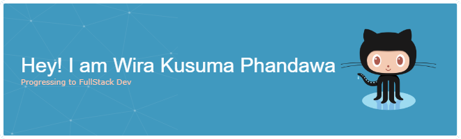

<div align="center">



</div>

## Nice to meet you!
##### Im junior Web Development
<!--
**Wira-Kusuma/Wira-Kusuma** is a ✨ _special_ ✨ repository because its `README.md` (this file) appears on your GitHub profile.

Here are some ideas to get you started:

- 🔭 I’m currently working on ...
- 🌱 I’m currently learning ...
- 👯 I’m looking to collaborate on ...
- 🤔 I’m looking for help with ...
- 💬 Ask me about ...
- 📫 How to reach me: ...
- 😄 Pronouns: ...
- ⚡ Fun fact: ...
-->
<hr>

##### 🌱 I’m currently learning :

 

<br>

##### 📫 How to reach me :

  

<br>

### My GitHub : 
<div align="center">


</div>


<div align="center">
  
  
</div>

<br clear="both">

<br clear="both">

 Hell noo!!, stop the snake

###


#### FunFact ```Im poor 😥```